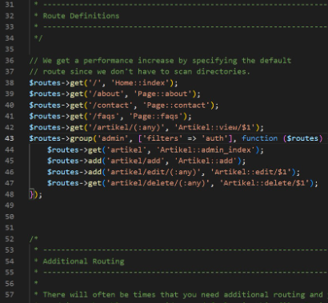

# Lab13web
untuk memenuhi tugas pemogramman web
Pratikum 13<br>

Nama     : Antini permatasari<br>
NIM      : 312010095<br>
kelas    : TI.20.B.1<br>

## Lanjutan Framework

Selanjutnya Untuk memulai membuat modul Login, yang perlu disiapkan adalah database server
menggunakan MySQL. Pastikan MySQL Server sudah dapat dijalankan melalui XAMPP.<br>

# 1.Membuat Tabel User


# 2.Membuat Model User
 
Membuat Model adalah untuk memproses data Login. Buat file baru pada
direktori app/Models dengan nama UserModel.php seperti berikut.<br>


# 3.Membuat Controller User

Selanjutnya kita Buat Controller baru dengan nama **User.php** pada direktori **app/Controllers.**
Kemudian tambahkan method **index()** untuk menampilkan daftar user, dan method
**login()** untuk proses login.sebagai berikut.<br>


# 4.Membuat View Login

Lalu kita akan Buat direktori baru dengan nama **user** pada direktori **app/views**, kemudian buat file
baru dengan nama **login.php** sebagai berikut<br>


# 5.Membuat Database Seeder

Database seeder digunakan untuk membuat data dummy pada pengaturan awal aplikasi.<br>
Selanjutnya Untuk keperluan ujicoba modul login, kita perlu memasukkan data user dan password<br>
kedaalam database. Untuk itu buat database seeder untuk tabel user. Buka CLI,<br> 
kemudian tulis perintah sebagai berikut:<br>

```
php spark make:seeder UserSeeder
```


Kemudian kita buka file **UserSeeder.php** yang berada di lokasi direktori
**/app/Database/Seeds/UserSeeder.php** kemudian isi dengan kode seperti berikut:<br>


Selanjutnya kita buka kembali CLI dan ketik perintah sebagai berikut:

```
php spark db:seed UserSeeder
```


# 6.MenCoba Login

Kemudian kita buka url http://localhost/lab11_php_ci/ci4/public/user/login seperti berikut:<br>


# 7.Menambahkan Auth Filter

Selanjutnya kita akan membuat filer untuk halaman admin<br>
lalu kita Buat file baru dengan nama **Auth.php** pada direktori **app/Filters.**


Kemudian kita buka file app/Config/Filters.php tambahkan kode sebagai berikut:<br>

```
'auth' => App\Filters\Auth::class
```


Lalu kita buka file **app/Config/Routes.php** dan sesuaikan kodenya.<br>



# 8.Fungsi Logout

Selanjutnya kita Tambahkan method logout pada Controller User seperti berikut:<br>


Dan di pertemuan sebelumnya saya telah menambahkan menu logout di header admin.<br>
kemudian File itu ada di direktori **app\view\template** lalu buka file **admin_header.php** lihat kode sebgai berikut:<br>

```
<a href="<?= base_url('/admin/logout');?>">Logout</a>
```

